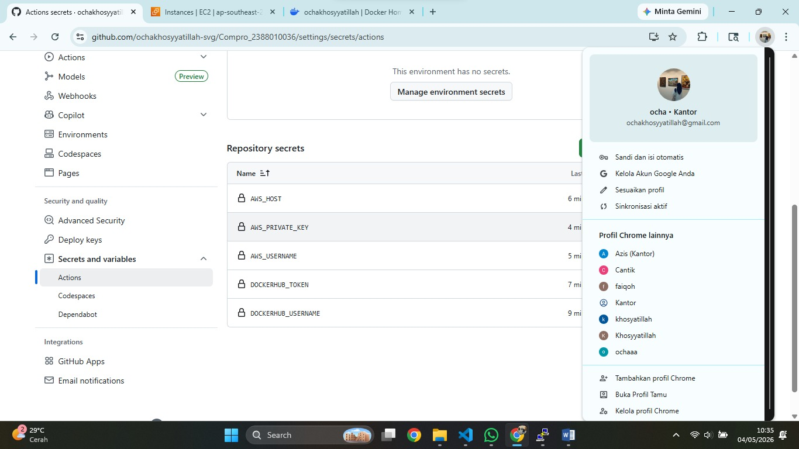
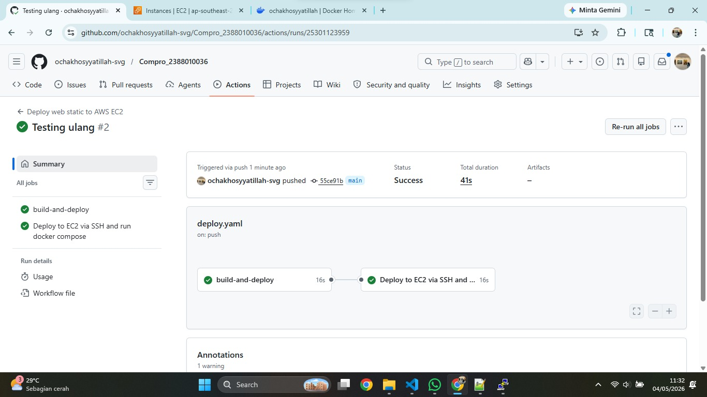

# Modernisasi CI/CD (continuos intergration/continuos delivery)
## Lanjutan Praktikum Pertemuan 10

1. Mengisi Secrets Variable di Github Actions
    - Buka repository di github
    - klik setting > secrets and variables > actions
    - klik new repository secret
    - isi nama = DOCKER_USERNAME dan value = username akun dockerhub
    - klik new repository secret
    - isi nama = DOCKERHUB_TOKEN dan value = token akun dockerhub
    - Klik new repository secret
    - isi nama AWS_HOST dan value = Ip addres EC2 instance
    - klik new repository secret
    - isi nama = AWS_USERNAME dan value = ubuntu
    - klik new repository secret
    - isi nama = AWS_PRIVATE_KEY dan value file .pem

2. Melakukan Edit file pipeline di github
    - buka projek compro_nim
    - buat folder baru .github > buat folder workflows > buat file deploy.yaml
    - isi file deploy.yaml sebagai berikut : 

    name: Deploy Web Statis to AWS EC2
on:
  push:
    branches: [ main ]
jobs:
  build-and-deploy:
    runs-on: ubuntu-latest
    steps:
    - name: Checkout code
      uses: actions/checkout@v4
    - name: Login to Docker Hub
      uses: docker/login-action@v3
      with:
        username: ${{ secrets.DOCKERHUB_USERNAME }}
        password: ${{ secrets.DOCKERHUB_TOKEN }}
    - name: Build and push Docker image
      uses: docker/build-push-action@v5
      with:
        context: .
        push: true
        tags: ${{ secrets.DOCKERHUB_USERNAME }}/compro_2388010036:latest

  deploy:
    needs: build-and-deploy
    runs-on: ubuntu-latest
    name: Deploy to EC2 via SSH and run docker compose
    steps:
    - name: SSH and deploy
      uses: appleboy/ssh-action@v1.0.3
      with:
        host: ${{ secrets.AWS_HOST }}
        username: ${{ secrets.AWS_USERNAME }}
        key: ${{ secrets.AWS_PRIVATE_KEY }}
        port: 22
        script: |
          docker rm -f compro_2388010046 || true
          docker pull ${{ secrets.DOCKERHUB_USERNAME }}/compro_2388010036:latest
          docker run -d --name compro_2388010036 -p 80:80 ${{ secrets.DOCKERHUB_USERNAME }}/compro_2388010036:latest

3. hasil finall

