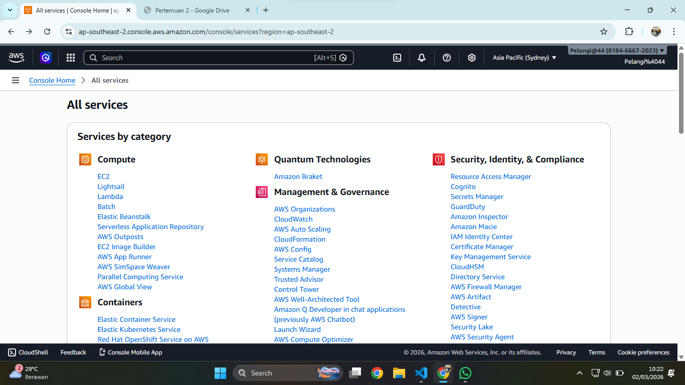
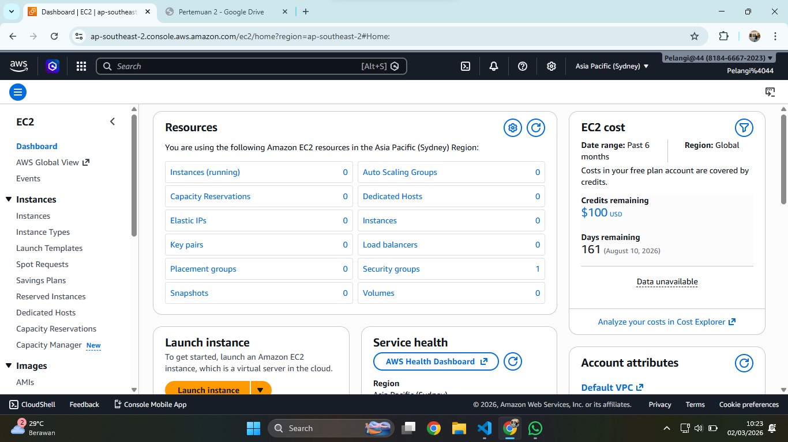
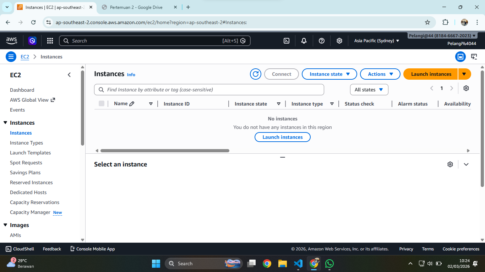
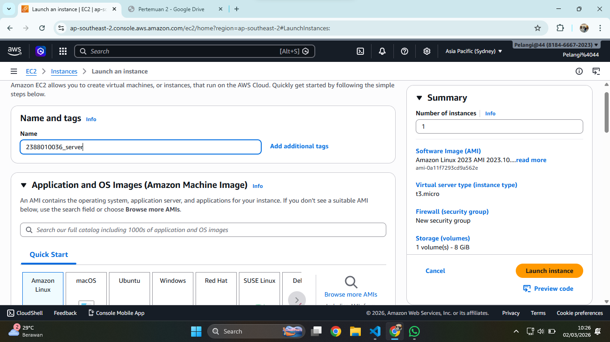
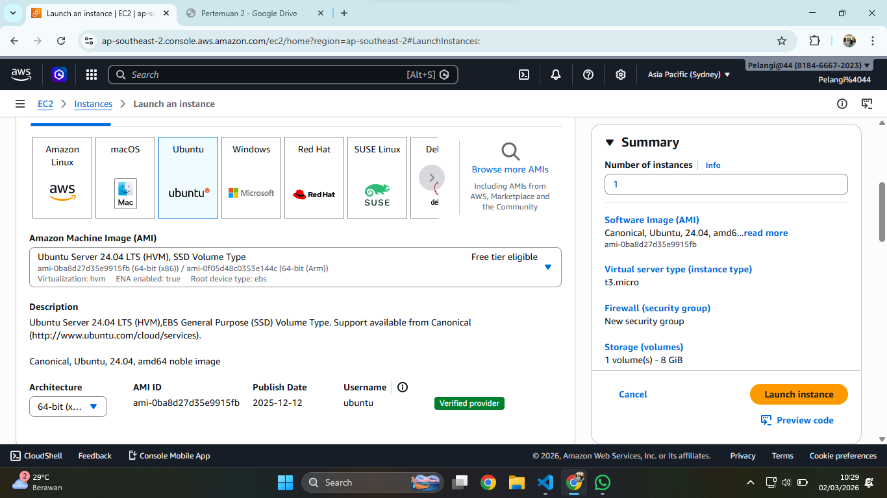
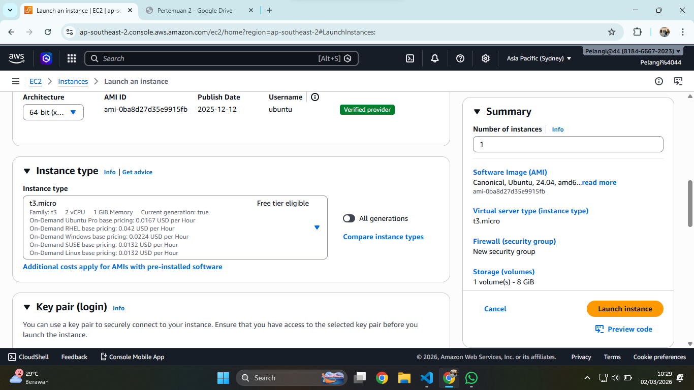
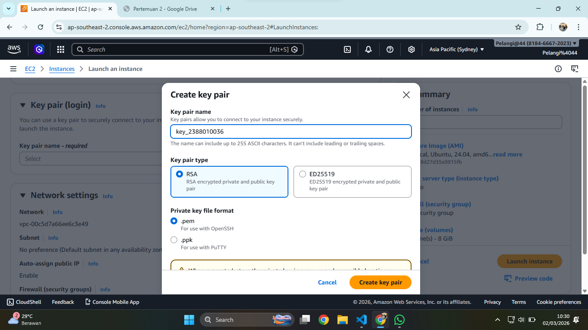
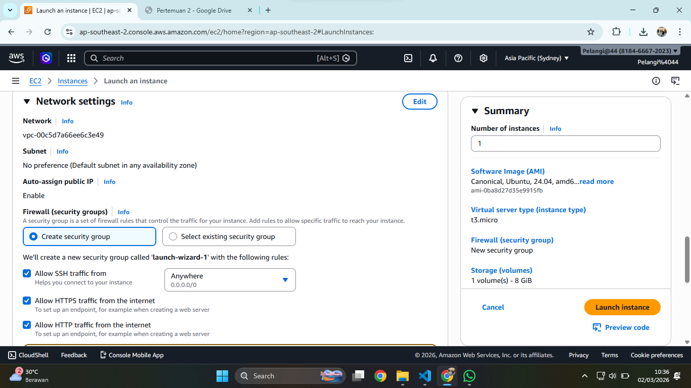
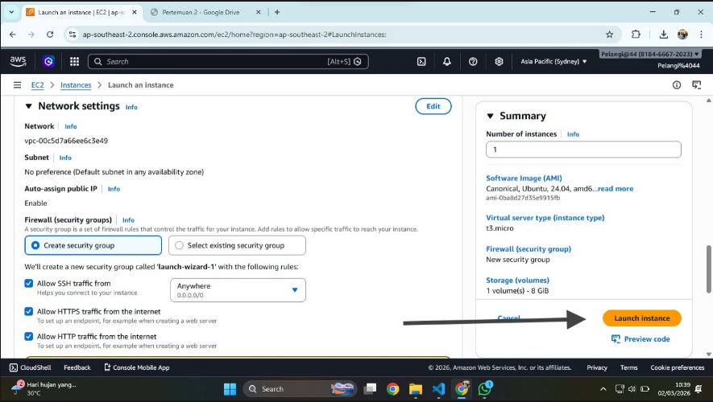
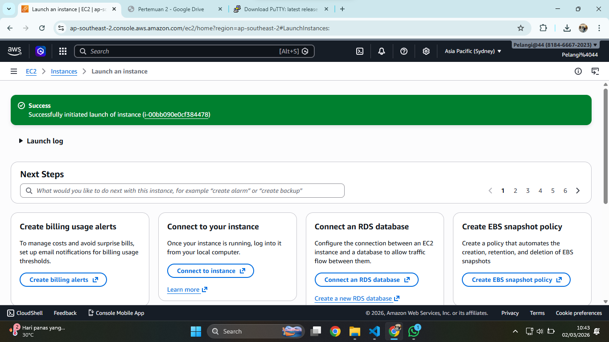

# Membuat EC2 / Instance / VM

1. Pilih Menu All Services -> EC2

2. di dalam menu EC kita pilih instance

3. didalam menu instance pilih launch instance

4. Beri nama Instance kita dengan format NIM_server

5. kita pilih OS server untuk instance

6. pilih Resource instance T3.Micro (2VCPU, 1GB Memory)

7. membuat key pair, pilih new key pair, isi nama key, pilih RSA, format file.pem, create key pair

8. Setting kebijakan keamanan/Security Group
   1. Allow SSH - Artinya membolehkan remote SSH dari luar
   2. Allow HTTPS - Artinya Instance bisa diakses dari protocol HTTPS
   3. Allow HTTP -> Artinya instance bisa di akses dari protocol HTTP

9. selesai Set-up pilih Launch Instance

10. Pastikan Launch Instance Sukses

