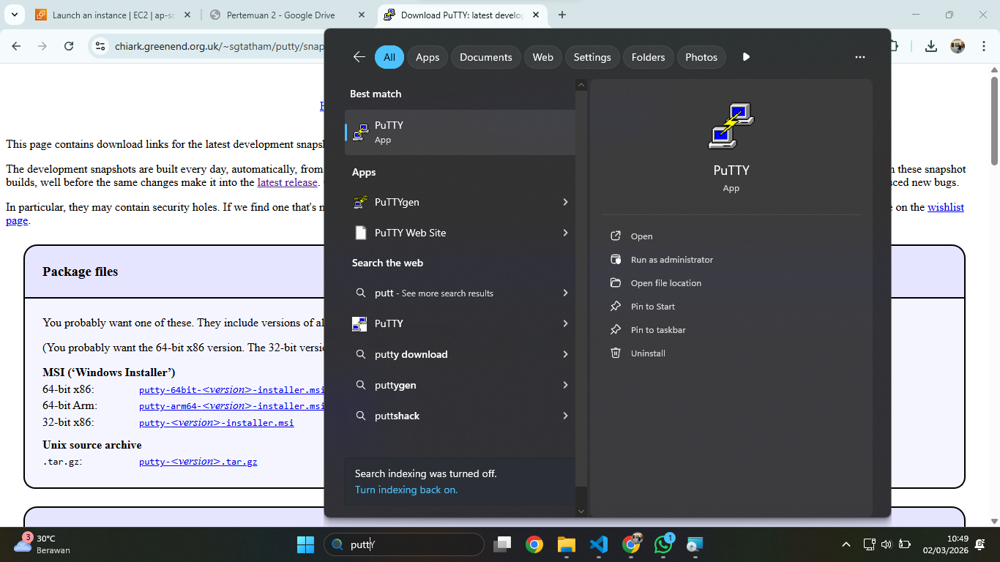
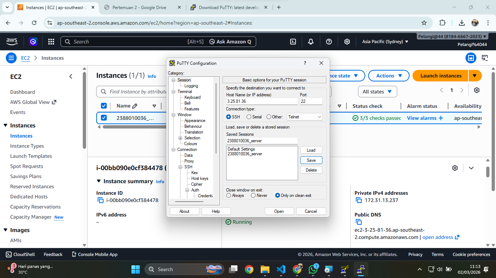
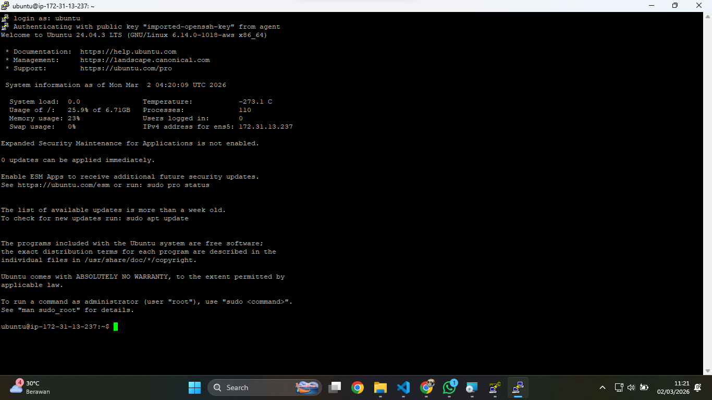
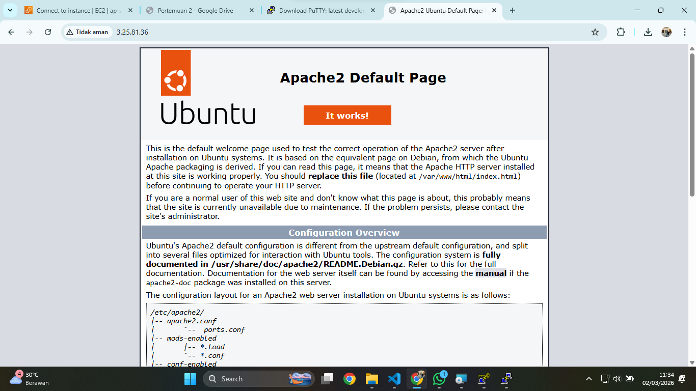
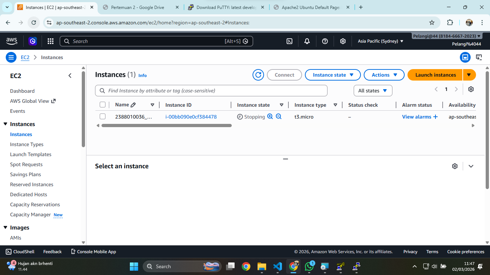

# Remote Instance with SSH Putty

1. Pastikan sudah Install Putty

2. Konversi file Public Key dari .pem menjadi .ppk di putty

 
3. Set Up Putty untuk Remote SSH

4. "sudo apt-get Update"(Update OS) lanjut "sudo apt-get Upgrade"
5. Pembuktian Remote SSH secara visual

6. sudo shutdown now
