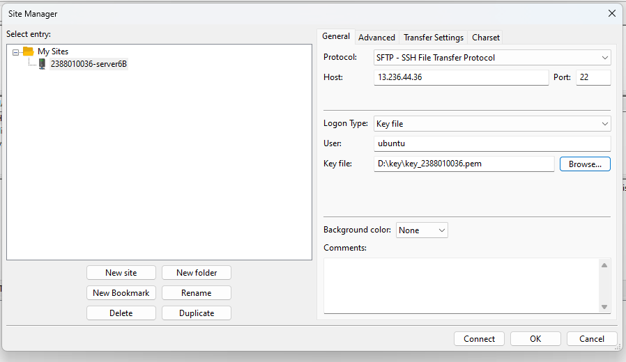
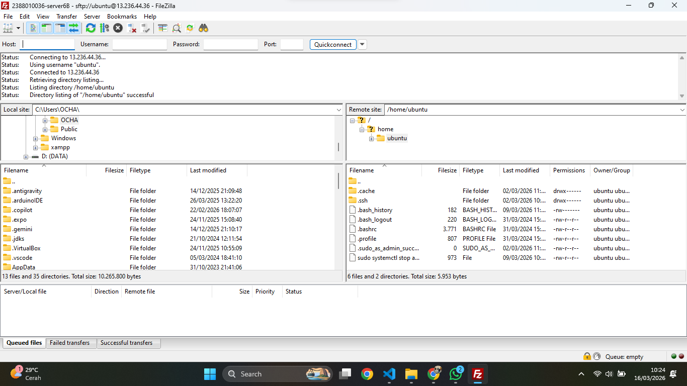
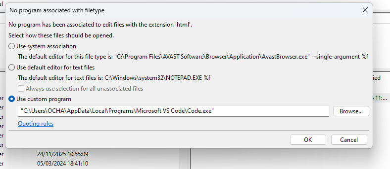
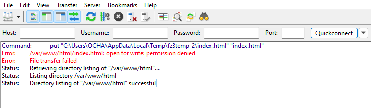
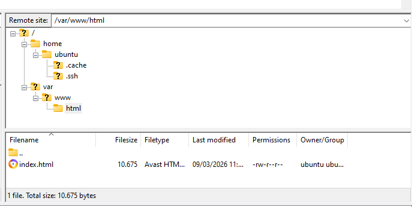
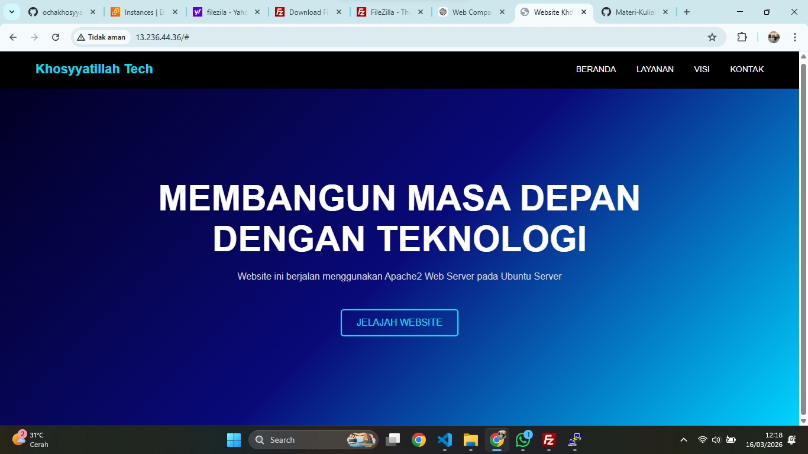

# Migrasi file local ke cloud server (AWS Ec2)

1.  Memilih tools Migrasi File, misal kita akan  gunakan FileZila
- unduh dan Install di https://filezilla-project.org/download.php?type=client
- Buka Filezilla Client
- Aktifkan Instance di AWS
- Kembali ke FileZilla Client
- Klik File > Site Manager
- Klik New Site
- Protocol > SFTP
- Host > IP Public EC2
- Port > 22
- Logon Type > Key file
- User > ubuntu
- Key file > Pilih file .ppk / .pem yg didownload saat membuat instance
- Klik Ok
- CTRL + S
- Klik Connect

2. pada Dasboard utama fileZilla akan menjadi 2 panel
- panel kiri > file local (komputer Anda)
- panel kana > file server (AWS EC2)

3. Arahkan directory Cloud (panel kanan) ke folder web server services area 
- /var/www/html

4. untuk solusi permission denied pada folder /var/www/html
- ubah kepemilikan folder
- mengubah folder /var/www/html agar bisa diakses oleh user 'ubuntu'
- Sintaks: sudo chown -R ubuntu:ubuntu /var/www/html

5. edit file index.html menjadi company profil
- klik kanan pada file index.html
- klik edit
- edit file index.html menjadi company profil
