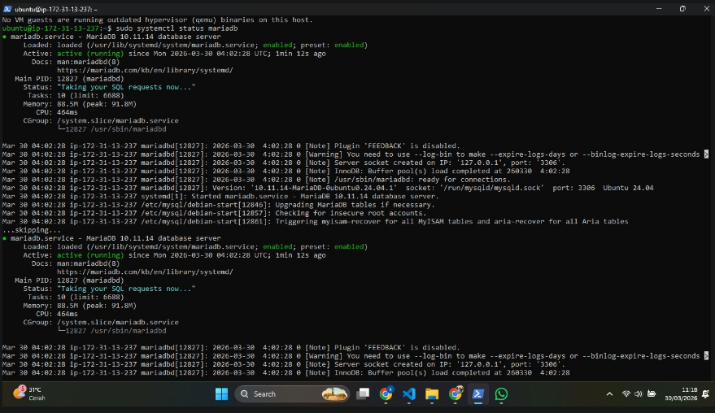
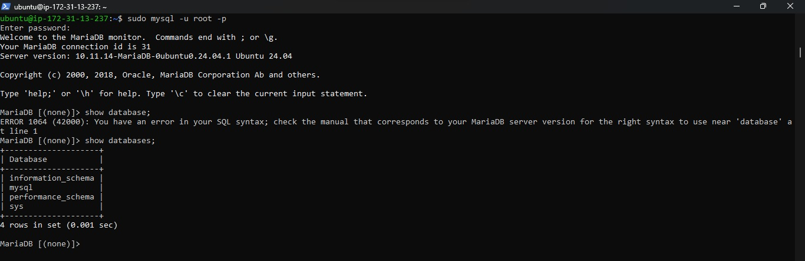
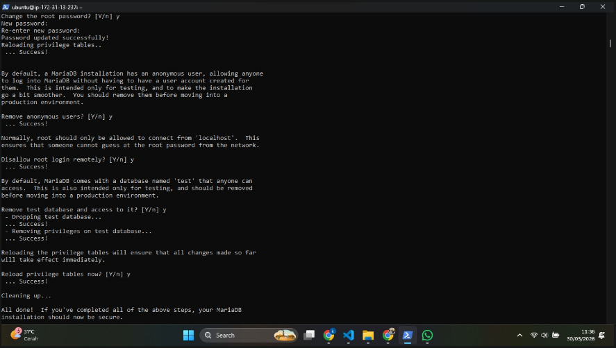
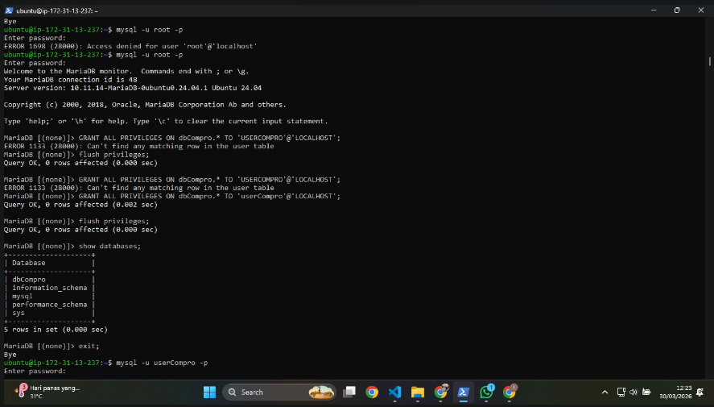
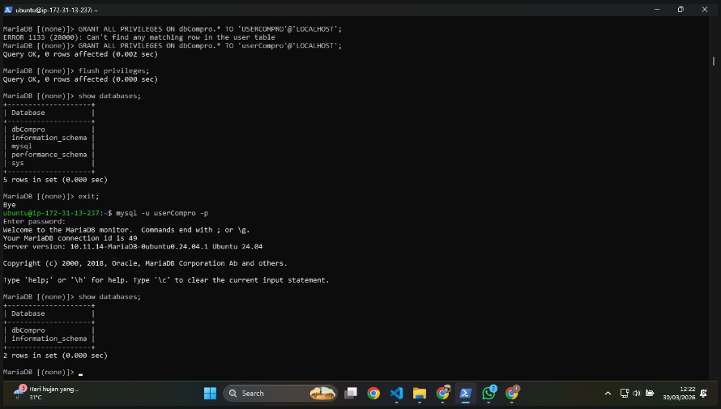

# Membuat Database Mysql di AWS EC2

1. Aktifkan Instance / VM di Ec2
2. Remote SSH via Terminal
- masuk ke folder penyimpanan privat key AWS
- masukan command (ssh -i namafile.pem ubuntu@[IP_ADDRESS])
- tekan enter
- keterangan open SSH hanya support di windows 11
- jika menggunakan windows 10 kebawah gunakan putty
3. Lakukan Patching OS
- sudo apt-get update && sudo apt-get upgrade
4. kita akan install MariaDB
- sudo apt-get install mariadb-server / mysql-server
- sudo systemctl status mariadb
- coba apakah default setting yang berlaku (sudo mysql -u root -p)
- cek apakah masih ada database dummy (show databases;)

5. kita lakukan hardening security 
- masukan command (sudo mysql_secure_installation)
- masukan password kuat untuk akun root
- remove anonymous users (Y)
- dissallow root login remotely (Y)
- Remove test database and access to it (Y)
- Reload privilege tables now? (Y)

6. Membuat database dan user
- membuat database untuk web company profile (create database dbCompro)
- membuat user untuk web company profile (create user 'userCompro'@'localhost' identified by '***;)
- memberikan hak akses user untuk web company profile (grant all privileges on dbCompro. * to 'userCompro'@'localhost';)
- Flush Privilege (flush privileges;)
- keluar dari MySQL (exit;)

7. Login sebagai user baru
- masukkan command (mysql -u userCompro -p)
- masukkan password (***)
- cek apakah password

