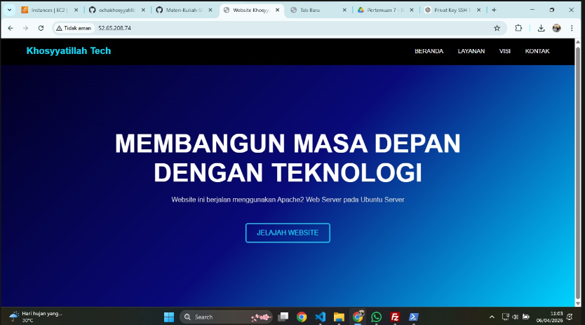

# Membuat Elastic IP di AWS

1. Jalankan Instance EC2 yang sudah di create sebelumnya
2. Ke menu network and security pilih menu elastics IP
- klik menu allocate elstic ip address
- pilih amazon's pool of IPv$ address
- network border group (us-east-1)
- isi tags (key=server-6B value Praktikum Elastic IP)
- klik Allocate
3. Associate kan
- centang mana EIP yang dipilih
- pilih actions -> associate elastic IP
- resource type pilih instance
- pilih instance (2388010040_server)
- klik associate

