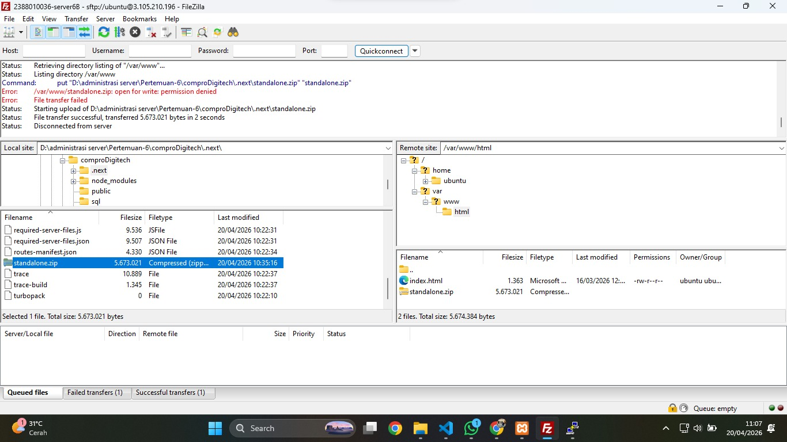
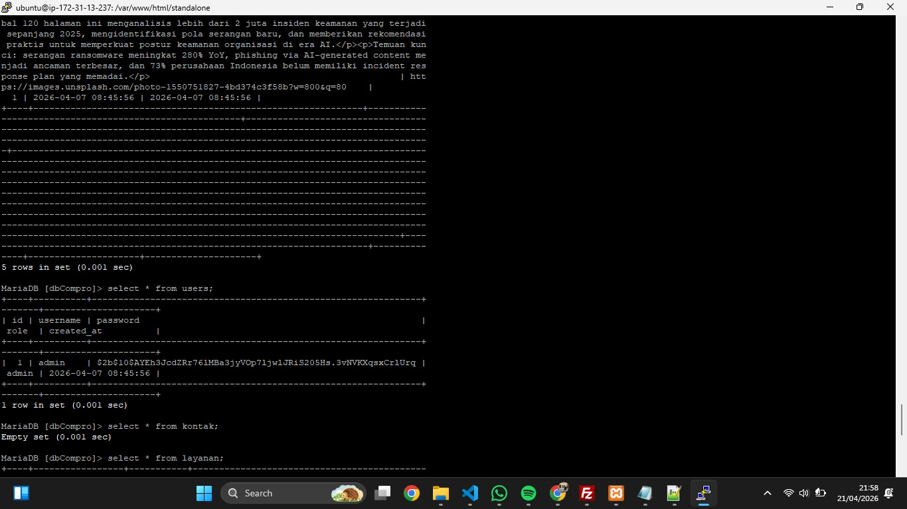
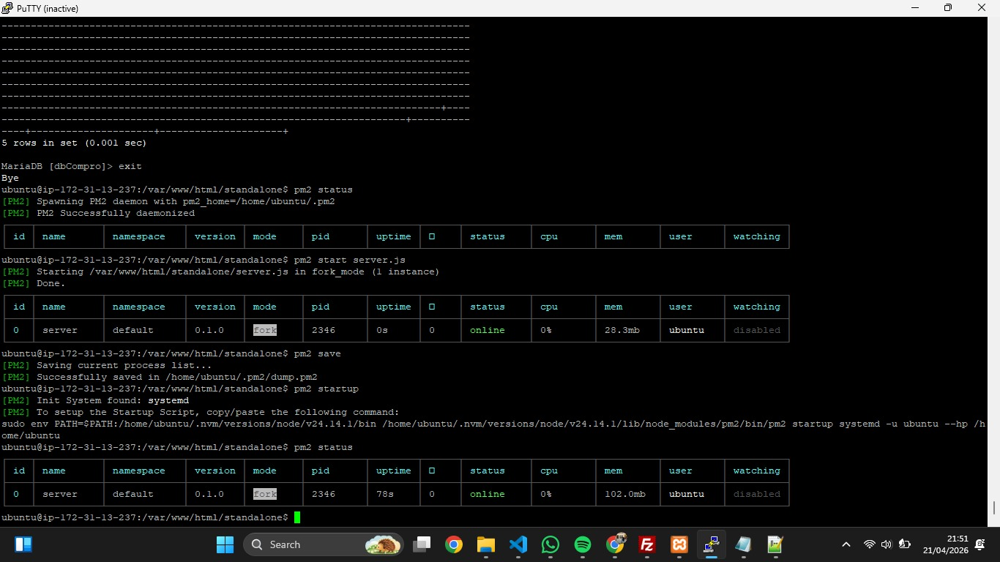
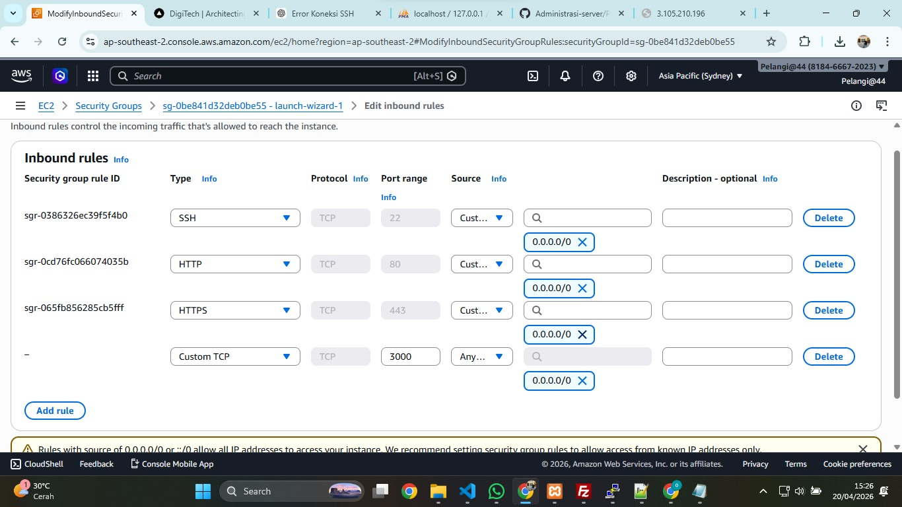
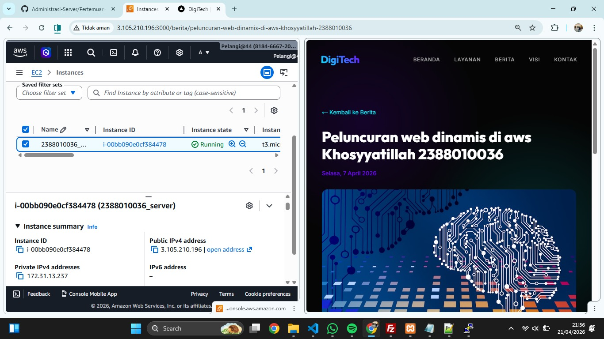
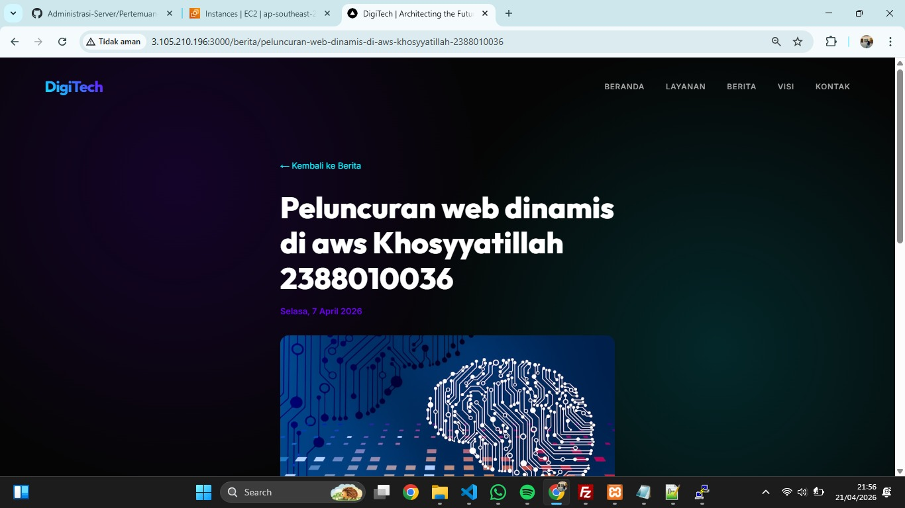

# Melakukan Uploading Web Apps Dynamic ke EC2 AWS

1. Pastikan web dinamik ini berjalan tanpa error di localhost
2. Jika sudah tanpa error kita akan membuat folder build
- npm run build
- pastikan menghasilkan folder .next/standalone didalam tersedia folder public dan di folder .next ada folder static
3. Proses upload file foler standalone
- Lakukan Proses Archive pada folder .next/standalone dan folder public .zip
- running instance -> connect open SSH -> connect FileZilla
- upload file hasil archive ke EC2 AWS menggunakan filezilla

- ekstrak file hasil archive di EC2 AWS
- Install tools unzip di ec2 AWS
   - sudo apt install unzip -y
   - cd /var/www/html
   - ls
- Ekstract file hasil archive
  - unzip nama_file.zip

4. Export dbcompro dari localhost ke sql
- login ke SQL ec2 sudo mysql -u USERCOMPRO -p
- use dbCompro;
- copy paste query sql dari localhost (Engine dihapus)
- cek apakah tabel sudah terisi
  - select * from berita;
  - select * from users;
  - select * from kontak;
  - select * from layanan;
  

5. Sesuaikan isi file .env
- DB_HOST=localhost 
- DB_USER=userCompro 
- DB_PASSWORD=passwordCompro 
- DB_NAME=dbCompro 
- DB_PORT=3306

- NEXTAUTH_SECRET=ganti-dengan -string-acak-panjang-minimal-32-karakter
- NEXTAUTH_URL=http://3.105.210.196:3000/

6. Di termiinal ssh cd ke folderstandalone run apps 
- pm2 start server.js 
- pm2 save 
- pm2 startup
- pm2 status

7. Buka port 3000 di securitygroup ec2 aws
- edit inbound ruls -add rule
- save
- check perubahan 

