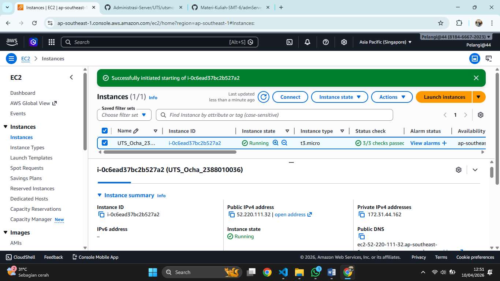
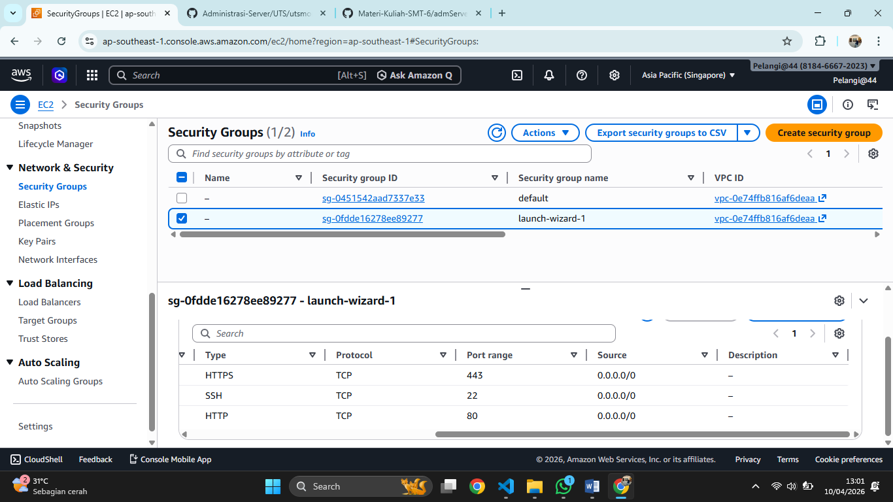
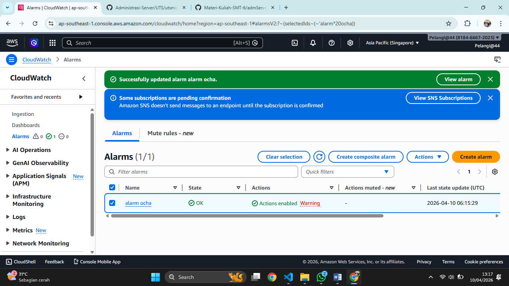
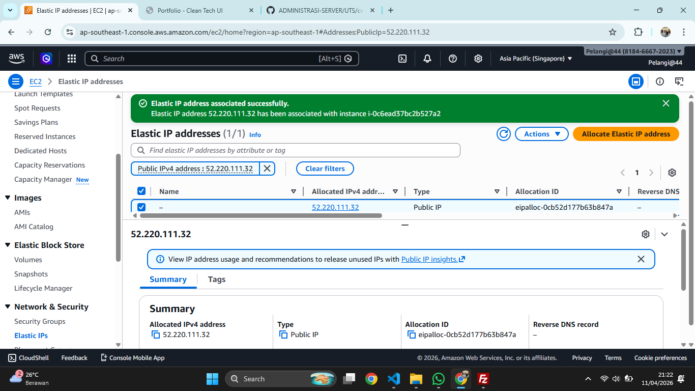
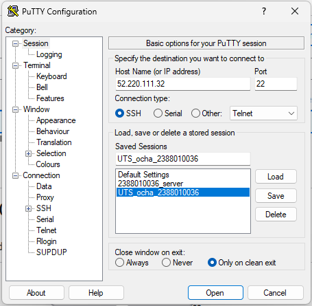
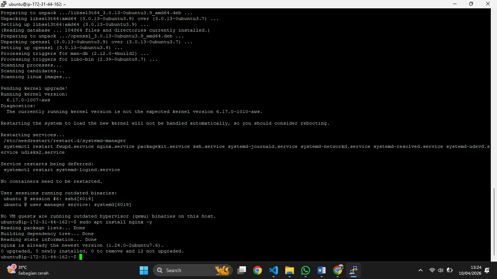
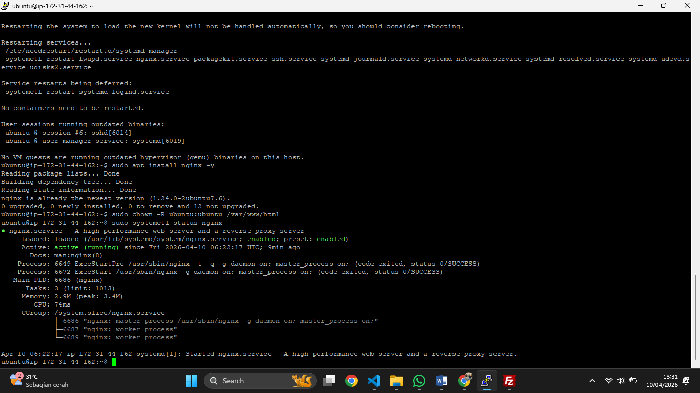
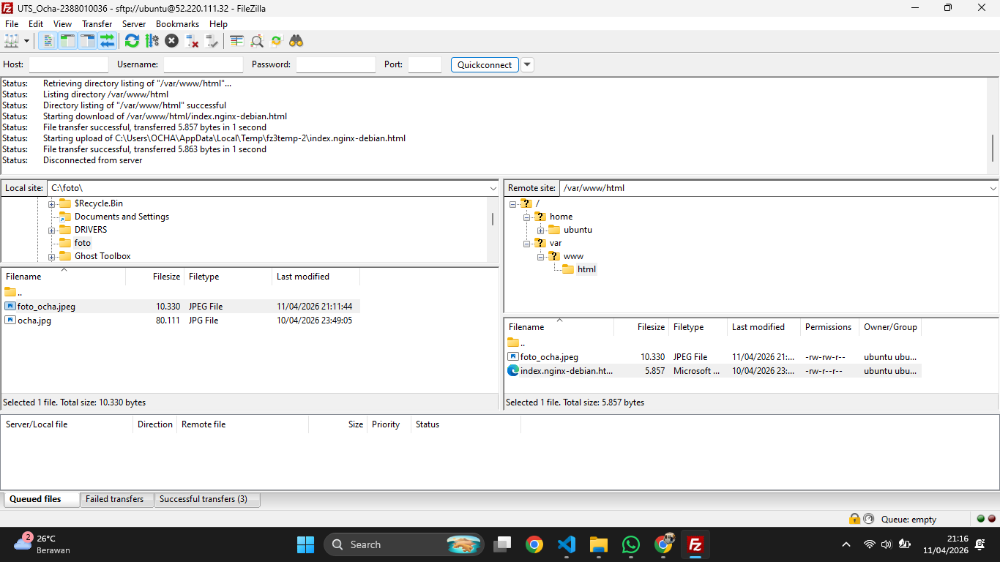
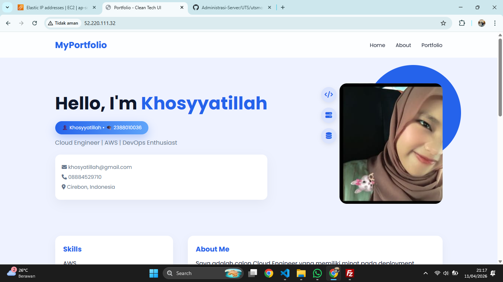

# UTS Adminstrasi Server
# Khosyyatillah
# 2388010036
# Informatika 6B
1. Membuat Instance

2. halaman security gruop

3. Membuat Alarm Clouwatch CPU 80%>

4. Membuat Elastic IP

5.  Remote SSH

6. Install Web server (Nginx Server)

7. berhasil running

8. Set up File Zilla

9. Website Curicullum Vitae

