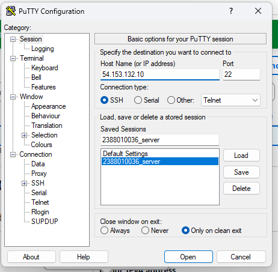
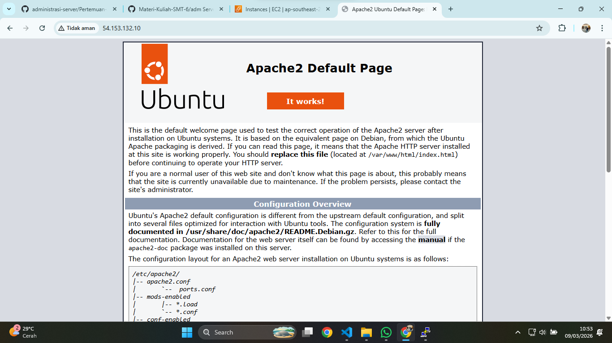
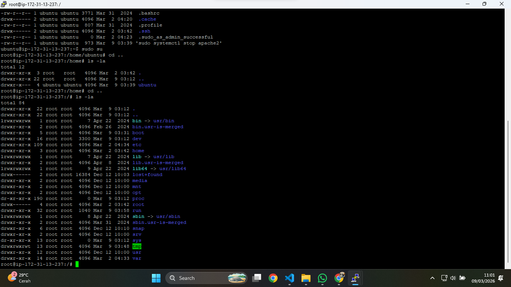
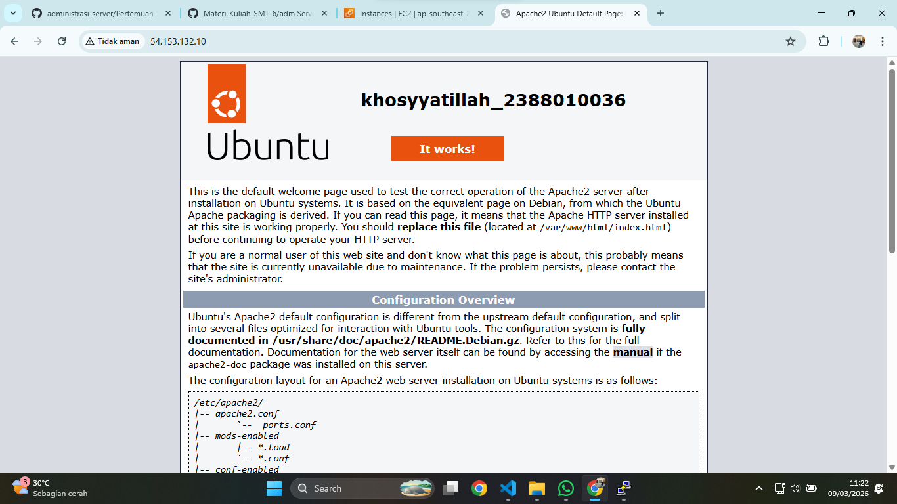
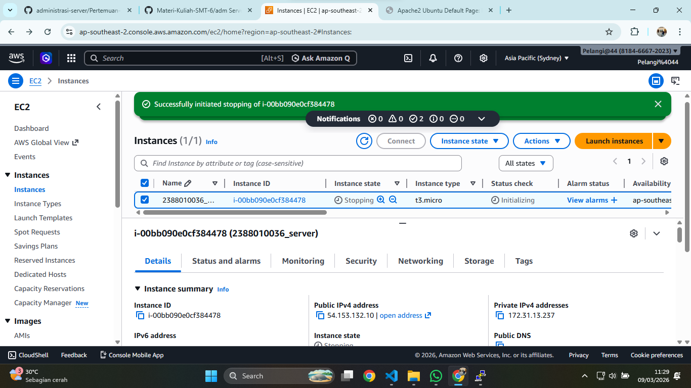

# implementasi beberapa comand line interface linux ubuntu

1. start instance 
2. Buka putty
3. kemudian Load save session yg disimpan pada pertemuan-2 (NIM_server)
4. Update bagian IpAddress V4

5. sudo Apt-get update (untuk Paching OS Linux server)
6. cek web server kita (systemctl status apache2)
7. sudo systemctl stop apache2 (untuk berhenti web server)
8. sudo system start apache2 (untuk start ulang web server)

9. masukan command (ls -la) untuk melihat directory tempat cursor aktif
10. masukan sudo su (untuk masuk ke home)
11. masukan cd .. ke root folder is -la

12. masuk ke folder var (cd var/www/html)
13. nano index.html untuk custom Nama dan Nim

14. shutdwon aws
